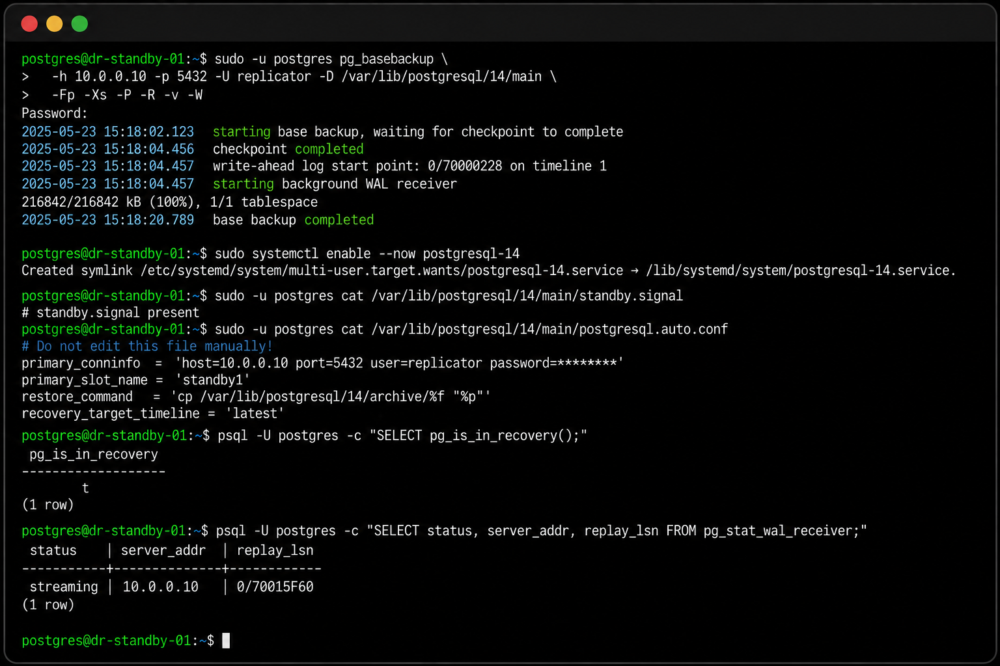

# PostgreSQL High Availability & Disaster Recovery Runbook

Production-ready PostgreSQL High Availability (HA) and Disaster Recovery (DR) runbook using Pgpool-II, Streaming Replication, automatic failover, standby rebuild, and disaster recovery validation.

---

## Architecture

<p align="center">
  
</p>

### Architecture Overview

This reference architecture demonstrates a production-ready PostgreSQL High Availability and Disaster Recovery deployment.

**Components**

- Clients / Applications
- Pgpool-II Cluster
  - Pgpool Node 1 (Active)
  - Pgpool Node 2 (Standby)
  - Pgpool Node 3 (Quorum / Witness only)
- PostgreSQL Primary
- PostgreSQL Synchronous Standby
- Remote Disaster Recovery Standby
- Shared Storage (optional)
- Monitoring & Alerting

### High Availability Features

- Pgpool-II connection pooling
- Load balancing
- Automatic failover
- Watchdog heartbeat
- Quorum-based decision making
- Streaming replication
- Replication slots
- Continuous WAL archiving
- Point-in-Time Recovery (PITR)
- Disaster Recovery promotion
- Standby rebuild using `pg_basebackup`

### Replication Topology

```text
Client
      │
      ▼
Pgpool-II VIP
      │
      ▼
Primary PostgreSQL
      │
      ├────────► Synchronous Standby
      │
      └────────► Asynchronous DR Standby
                     │
                     ▼
                 Promotion
                     │
                     ▼
               DR Primary

Pgpool-II Cluster

├── Pgpool Node 1
│      Active
│
├── Pgpool Node 2
│      Standby
│
└── Pgpool Node 3
       Watchdog Quorum Node
       No PostgreSQL Backend

```

## Features

- Pgpool-II High Availability
- Watchdog & Quorum
- Automatic Failover
- Streaming Replication
- Synchronous Replication
- Asynchronous Disaster Recovery
- Replication Slots
- WAL Archiving
- Point-in-Time Recovery (PITR)
- pg_basebackup
- Standby Rebuild
- Health Validation Scripts
- Production Runbooks

# PostgreSQL HA/DR Runbook


Vendor-neutral operational runbook and validation toolkit for PostgreSQL 14+,
Pgpool-II, synchronous local replication, asynchronous DR replication,
replication slots, pg_basebackup, pg_ctl promote, and standby.signal.

## Safety

- Replace all placeholders before use.
- Test in non-production first.
- Confirm backups, node roles, tablespaces, slots, and change approval.
- This public version contains no internal hostnames, IP addresses, credentials,
  company names, or confidential infrastructure details.

## Quick start

```bash
cp config/environment.example config/environment
vi config/environment
chmod +x scripts/bash/*.sh
./scripts/bash/check-cluster.sh
./scripts/bash/check-replication.sh
```
## Screenshots

### Pgpool-II Backend Nodes


### PostgreSQL Streaming Replication


### Replication Slots


### Replication Status Summary


### DR Promotion


### Standby Rebuild



## Structure

```text
postgresql-ha-dr-runbook
│
├── config/
├── diagrams/
├── docs/
├── examples/
├── images/
├── scripts/
│   ├── bash/
│   └── sql/
├── .github/
├── LICENSE
└── README.md
```

## Who is this for?

- PostgreSQL DBAs
- Platform Engineers
- DevOps Engineers
- SREs
- Infrastructure Engineers
- Database Consultants

## Related Projects

- PostgreSQL Health Check Toolkit

https://github.com/yousafzuhaib-web/postgresql-health-check

## Author

Zuhaib Yousaf Begum  
PostgreSQL Consultant
