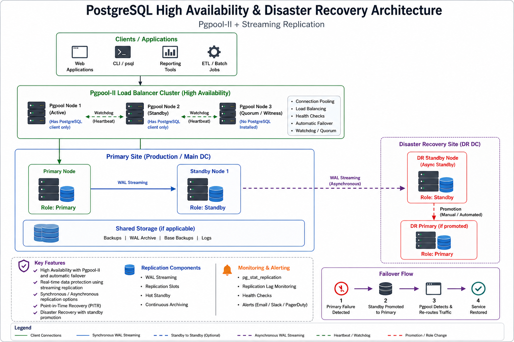
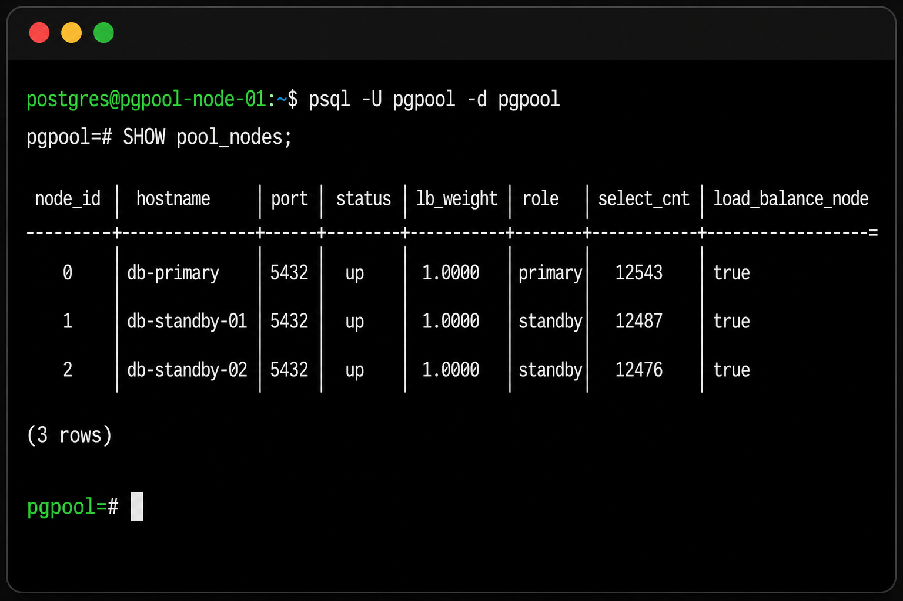
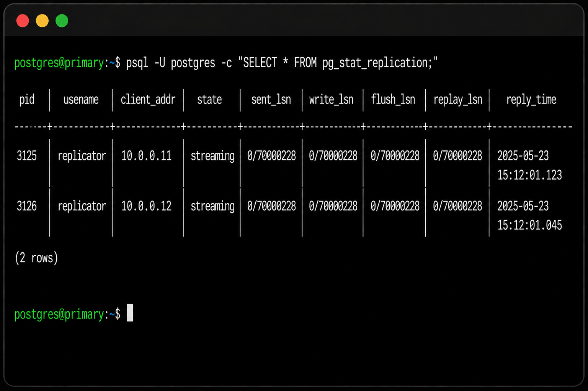
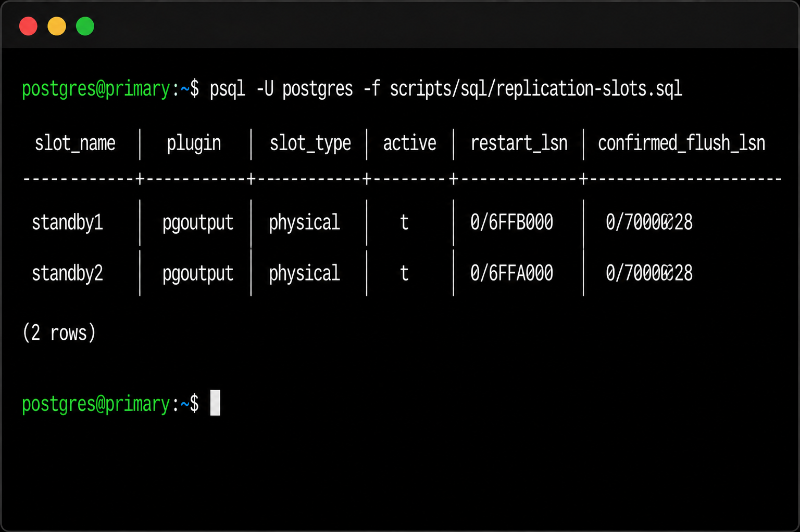
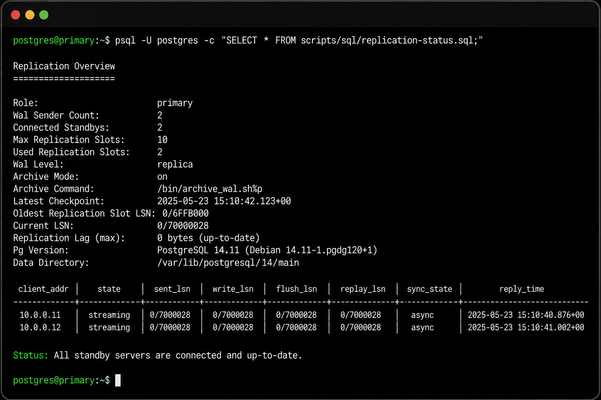
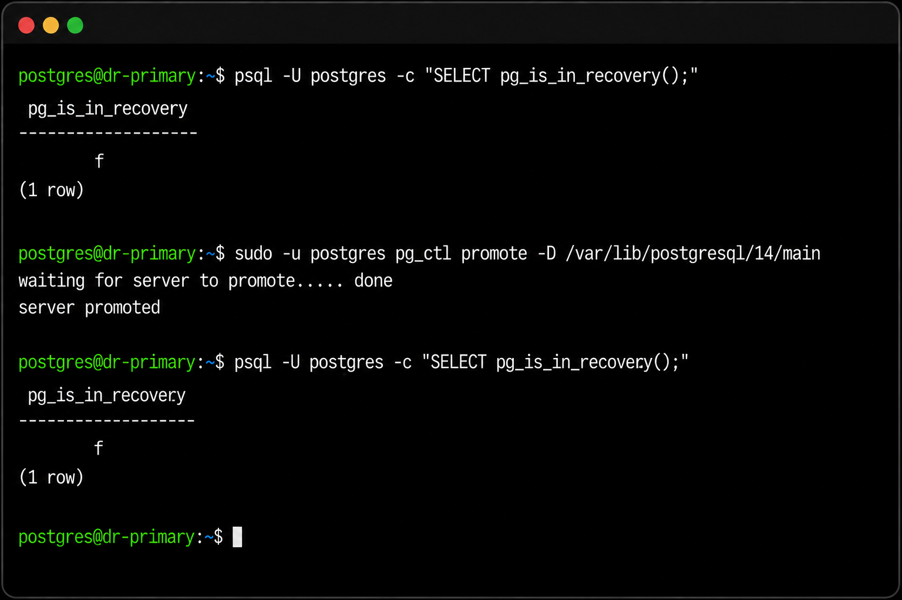

# PostgreSQL High Availability & Disaster Recovery Runbook

Production-ready PostgreSQL High Availability (HA) and Disaster Recovery (DR) runbook using Pgpool-II, Streaming Replication, automated failover procedures, standby rebuild, and disaster recovery validation.

## PostgreSQL High Availability & Disaster Recovery Architecture

<p align="center">
  
</p>

### Architecture Overview

This reference architecture demonstrates a production-ready PostgreSQL High Availability and Disaster Recovery deployment.

**Components**

- Clients / Applications
- Pgpool-II Cluster
  - Pgpool Node 1 (Active)
  - Pgpool Node 2 (Standby)
  - Pgpool Node 3 (Quorum / Witness only)
- PostgreSQL Primary
- PostgreSQL Synchronous Standby
- Remote Disaster Recovery Standby
- Shared Storage (optional)
- Monitoring & Alerting

### High Availability Features

- Pgpool-II connection pooling
- Load balancing
- Automatic failover
- Watchdog heartbeat
- Quorum-based decision making
- Streaming replication
- Replication slots
- Continuous WAL archiving
- Point-in-Time Recovery (PITR)
- Disaster Recovery promotion
- Standby rebuild using `pg_basebackup`

### Replication Topology

```text
Clients
      │
      ▼
Pgpool-II Cluster
      │
      ▼
Primary PostgreSQL
      │
      ├──────────────► Local Standby (Synchronous)
      │
      └──────────────► DR Standby (Asynchronous)
```
# PostgreSQL HA/DR Runbook


Vendor-neutral operational runbook and validation toolkit for PostgreSQL 14+,
Pgpool-II, synchronous local replication, asynchronous DR replication,
replication slots, pg_basebackup, pg_ctl promote, and standby.signal.

## Safety

- Replace all placeholders before use.
- Test in non-production first.
- Confirm backups, node roles, tablespaces, slots, and change approval.
- This public version contains no internal hostnames, IP addresses, credentials,
  company names, or confidential infrastructure details.

## Quick start

```bash
cp config/environment.example config/environment
vi config/environment
chmod +x scripts/bash/*.sh
./scripts/bash/check-cluster.sh
./scripts/bash/check-replication.sh
```
## Screenshots

### Pgpool-II Backend Nodes



### PostgreSQL Streaming Replication



### Replication Slots



### Replication Status Summary



### DR Promotion



## Structure

```text
config/environment.example
diagrams/architecture.md
docs/01-prechecks.md
docs/02-switchover.md
docs/03-dr-failover.md
docs/04-failback.md
docs/05-validation.md
examples/myrecovery.conf.example
images/
scripts/bash/check-cluster.sh
scripts/bash/check-replication.sh
scripts/bash/promote-node.sh
scripts/bash/rebuild-standby.sh
scripts/sql/replication-status.sql
scripts/sql/replication-slots.sql
```

## Author

Zuhaib Yousaf Begum  
PostgreSQL Consultant
