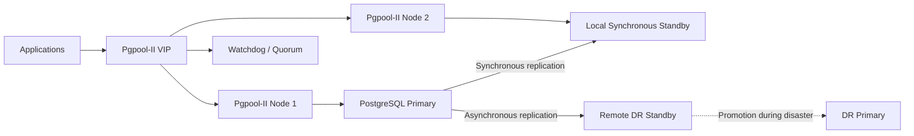

# Reference Architecture

```mermaid
flowchart LR
    APP[Applications] --> VIP[Pgpool-II VIP]
    VIP --> PGP1[Pgpool-II Node 1]
    VIP --> PGP2[Pgpool-II Node 2]
    VIP --> PGP3[Watchdog / Quorum]
    PGP1 --> PG1[PostgreSQL Primary]
    PGP2 --> PG2[Local Synchronous Standby]
    PG1 -->|Synchronous replication| PG2
    PG1 -->|Asynchronous replication| DR[Remote DR Standby]
    DR -. Promotion during disaster .-> DRP[DR Primary]
```
